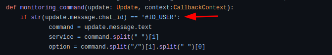
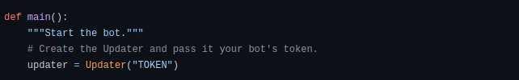

# Server Monitoring

The function of the script is the creation of a telegram bot for monitoring a Linux server and later its administration. For this, the python library **[telegram](https://github.com/python-telegram-bot/python-telegram-bot/tree/master/tests)** has been used, together with the **[os](https://docs.python.org/3/library/os.html)** library to be able to execute the commands.

## Start use

In the code you can find this: 

And this:

In this areas you must replace for you **User ID** and **Token** of your bots respectively

## How to use

You can use this command in the bot:

  - [**`/status`** `service`](#status) 
  - [**`/start`** `service`](#start) 
  - [**`/stop`** `service`](#stop) 
  - [**`/restart`** `service`](#restart) 
